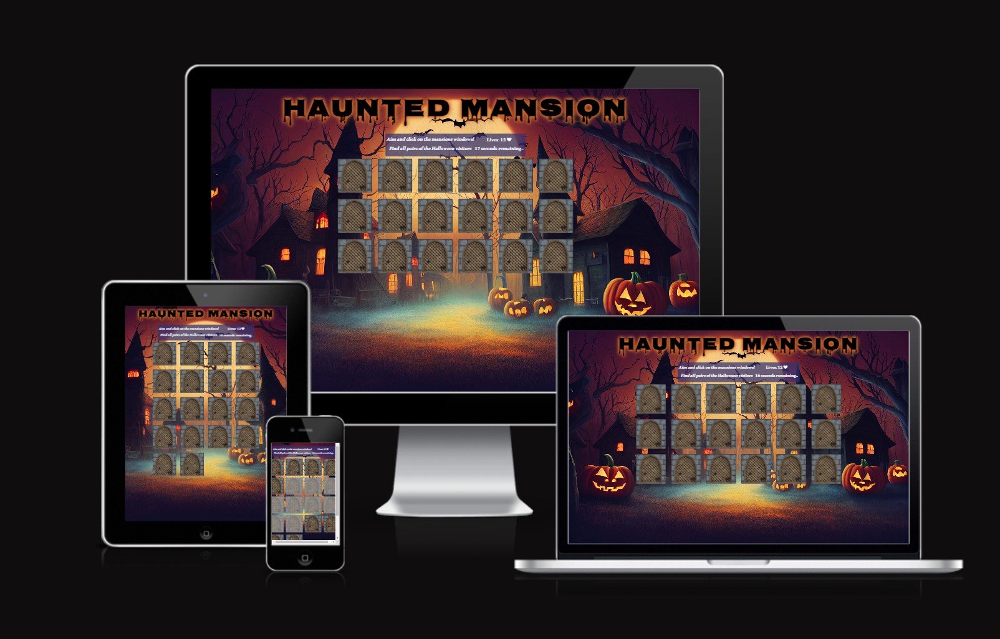
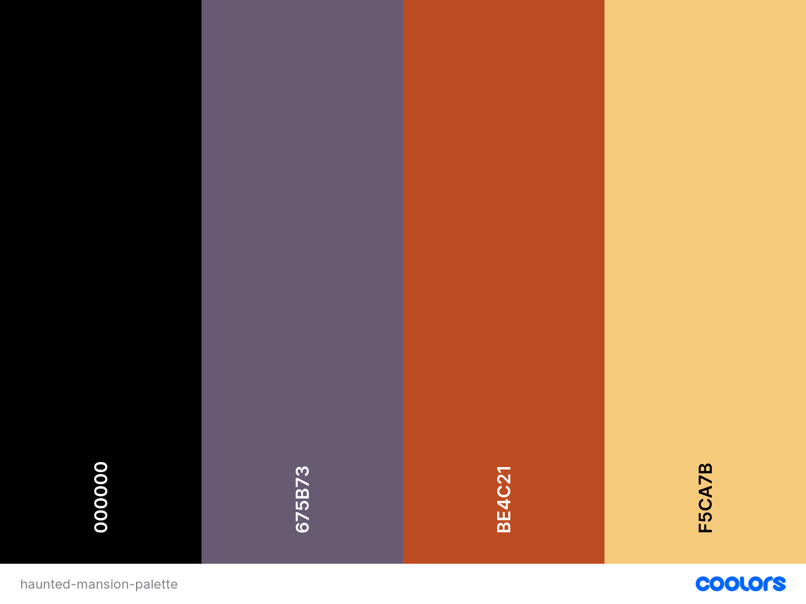
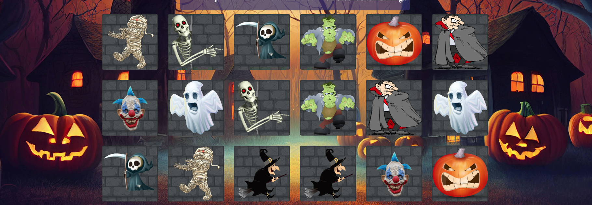
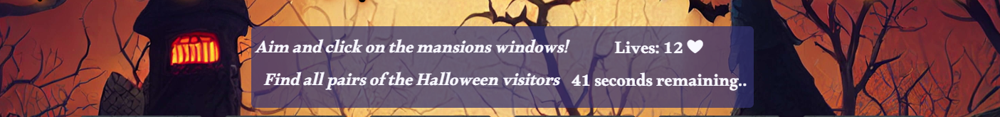
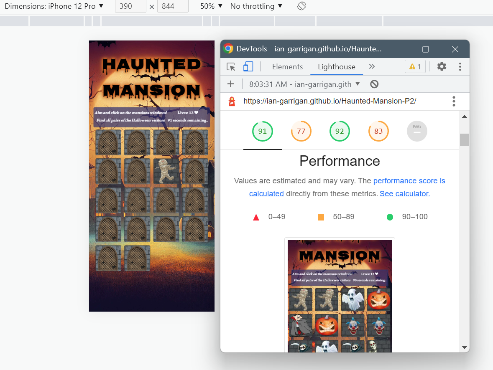
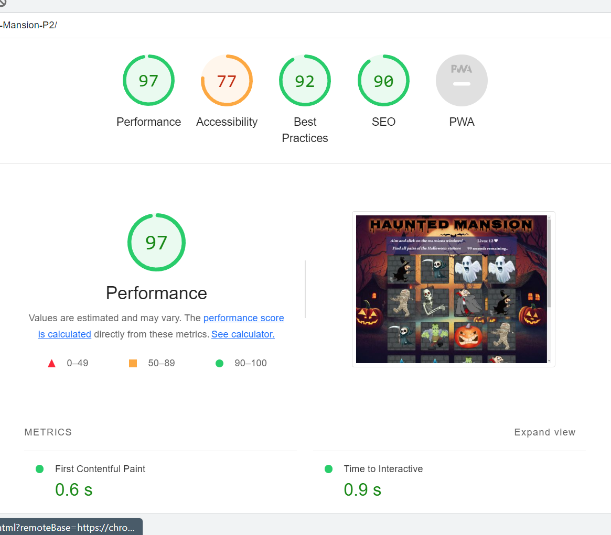
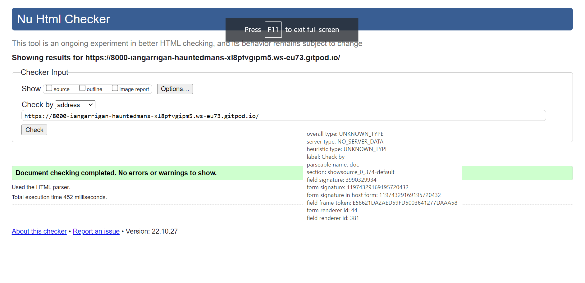
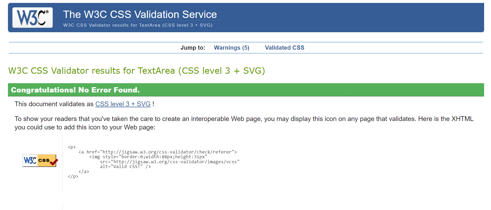
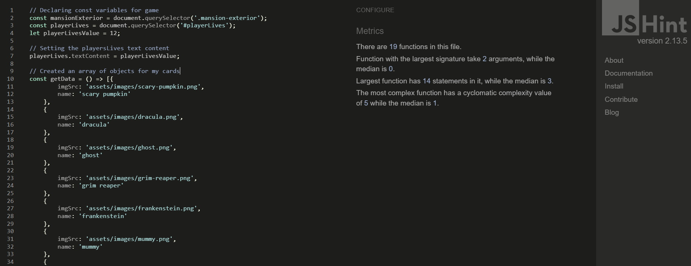

# Haunted Mansion

[View Haunted Mansion on Github Pages](https://ian-garrigan.github.io/Haunted-Mansion-P2/)

------------

------------
Haunted Mansion is a halloween theme inspired memory game for everyone to play. The player is tasked with the goal of matching two of the same cards that are placed face down and turned over to reveal themselves on click. Its a great game for cognitive memory building and fast thinking. The cards are always shuffled and revealed for two seconds as every new game commences. This simple game is just what you need as the festivities are just around the corner. Trick or treat! Dont forget to share with kids theyll love it too.

------------

## Design

### Colour Scheme

The website keeps the color tone dark and quintessentially Halloween vibe. The pumpkin orange tone cannot be mistaken, black and purple shades complement the entire cast behind the mansion wall. The colour palette was created using the [Coolors](https://coolors.co/) website.

### Typography

[Google Fonts](https://fonts.google.com/) and [Font Squirrel](https://www.fontsquirrel.com/) was used for the following fonts:

* Nosifer was used for the games title. It emanates a dark stench as it drips from the Internet. I chose this font because its horrifying. 

* Pphatton-medium and Alkalami is used for the game information text.

### Imagery

I would like to give a big thanks to [Vecteezy](https://www.vecteezy.com/). This wonderful free license site has a huge catalog of halloween png images. I picked 9 of the most popular and well known halloween characters. They are undeniably spooky. The background image sets up the game nicely with pumpkins, autumn trees and two creepy mansions.

------------
## Features 

The website only consists of one page. Its viewport does not move on scroll and you only have the game as the main important element. 

### Existing Features

This interactive memory game has 18 cards with worn down weave style windows as the image cover. There are eight monsters to pair up together. The game is won when all 8 have been found before you run out of lives and the timer doesnt reach zero. You have to be quick and smart at the same time. 

__The game automatically resets if either of the following occurs:__

- You run out of your 12 lives before matching all cards
- You are too slow and the 100 second countdown hits zero
- You win the game by revealing all pairs before the previous two things happen

 __The timeout displaying the card monsters to user from game start__

The windows are turned open at the begining for two seconds to give the user a quick chance to memorise the locations of each monster. This feature is necessary for the game difficulty to be at a fair standard.

__Clickable animated cards__

If a match is made, the cards will remain face up until the end of play and the reset button is clicked. If no match is found, both cards will flip back over and remain clickable for future guesses.

__Game Info__

This box displays the important current data for the player. The countdown timer and number of lives left as you play the game. It alsi informs the player what they should try and do. 

## Technologies Used

### Languages Used

JavaScript, HTML and CSS were used to create this website.

### Libraries & Programs Used

[Javascript](https://en.wikipedia.org/wiki/JavaScript) - For the logical behaviour and manipulating the DOM.

Git - For version control.

[Github](https://github.com/) - To save, store the files and deploy the website.

[Google Fonts](https://fonts.google.com/) & [Font Squirell](https://www.fontsquirrel.com/) - Used to import fonts and create a webfont kit for the site.

[Vecteezy](https://www.vecteezy.com/) - Used to source copyright free images. 

[Favicon.io](https://favicon.io/) - Used for generating a favicon.

Gitpod - Used as the interactive development environment (IDE) for the project.

### Features Left to Implement

- I would like to implement an audio track for each new game started which would be muted by default but clicked to play by a toggle switch above the the game info. 

- Adding and subtracting a player live or ten seconds to the countdown would be a nice feature along with sound effects for each match. 

## Testing 

- Testing was ongoing throughout the entire build. I became very familair with my Chrome developer tools while building and troubleshooting any issues as I went along.I can say positively that i am very happy with my findings on all devices. 

Testing game functionality involved:

- Game start/restart function
- Countdown timer behaviour
- Player lives Counter
- Checking match

| Features | Expected | Action | Result |
| -------- | -------- | ------ |-----   | 
| Card flips | The card should spin 90 degrees to face user | click on card | card flips and shows monster |
| Countdown timer| The time should count from 100 to 0  | start a new game or refresh | time counts down every 1000ms until 0 then resets |
| Card match | If two cards have same name attribute they remain revealed | find a matching pair | match stays flipped |
| Not a match | both cards should flip back to hide behind window after 1000ms | click on cards that does not match | cards flipped over after expected time interval|
| player lives total | 12 lives in total to start with then subtract 1 for every wrong match attempt | click on wrong cards| lives total deducted -1 |
| Win game| all 18 cards toggled over and alert user they won | pick the 9 card matches | user alerted with text "happy halloween" you found all the monsters |

-----------------------------------------------------------------------------------------------------------------

The following lighthouse reports are for for desktop and mobile:

## Bugs

- I had to change the variable value of playerLivesCat (now playerLivesValue) from const to a var to allow the code run a check of the array of objects. [screenshot](documentation/bug-5-console.jpg) and [var change](documentation/change-const-var-bug-5.jpg)

- I did not have the correct code to return the invoked function [here](documentation/no-return-invoked.jpg). I added the return to the end of the function to get the data back from it [here](documentation/return-added.jpg).

### Validator Testing 

-  No errors were returned when passing through the official HTML W3C validator.
------------
- 
 ------------
 No errors were found when passing through the official
 Jigsaw CSS validator. 

 ------------
JShint javascript validator
- 

## Deployment

The site was deployed to GitHub pages. The steps to deploy are as follows: 
  - In the [GitHub repository](https://github.com/Ian-Garrigan/Haunted-Mansion-P2), navigate to the Settings tab 
  - From the source section drop-down menu, select the **Main** Branch, then click "Save".
  - The page will be automatically refreshed with a detailed ribbon display to indicate the successful deployment.

The live link can be found [here](https://ian-garrigan.github.io/Haunted-Mansion-P2/)

### Local Deployment

In order to make a local copy of this project, you can clone it. In your IDE Terminal, type the following command to clone my repository:

- `git clone https://github.com/Ian-Garrigan/Milestone-Project-1.git`

Alternatively, if using Gitpod, you can click below to create your own workspace using this repository.

## Credits 
- I used [Stack Overflow](https://stackoverflow.com/) for general troubleshooting code
- [Shuffle](https://en.wikipedia.org/wiki/Fisher%E2%80%93Yates_shuffle) understanding here
- [A Youtuber](https://www.youtube.com/watch?v=-tlb4tv4mC4) for help laying down logic and style animation
- [Anshika](https://github.com/ANSHIKA1806/CardFlip_Game) for gaining an idea of what to implement
- [Custom cursor](https://www.freecodecamp.org/news/how-to-make-a-custom-mouse-cursor-with-css-and-javascript/#:~:text=Now%20how%20do%20I%20use,png')%2Cauto%3B%20%7D)

### Content 
- [SetTimeout()](https://www.w3schools.com/jsref/met_win_settimeout.asp) learning about this method 
